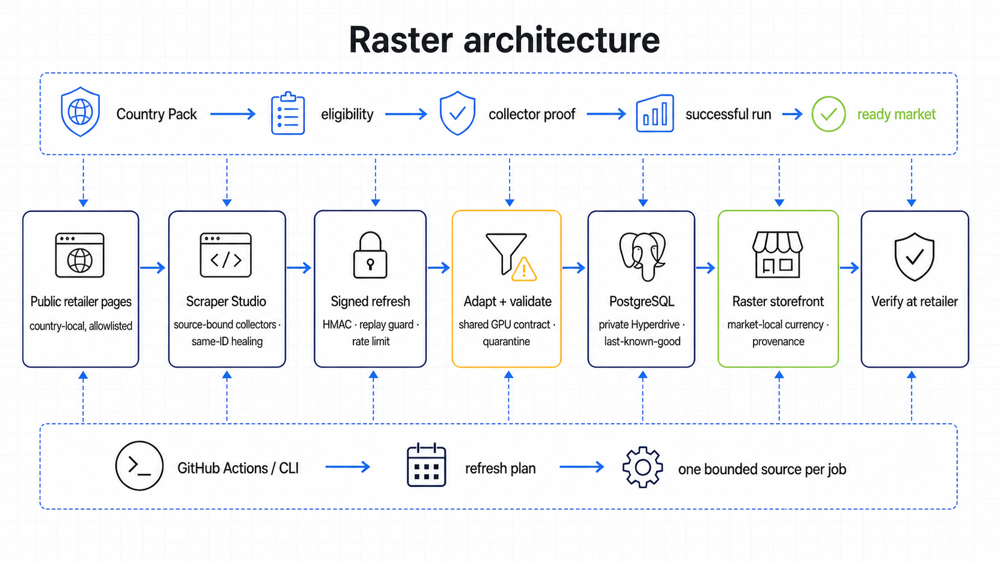

# Raster GPU Marketplace

Raster is “the GPU market without the tab circus”: an ecommerce-style comparison
site that turns public GPU listings from regional retailers into dated,
normalized offers. It helps a shopper compare and then hands off to the
original retailer. Raster is not the merchant: it does not process payment,
reserve inventory, or guarantee a price.

The project is being built for WeMakeDevs’ Into the Scrape-Verse hackathon. The
Bright Data Scraper Studio collector, terminal-first operations, scheduled
ingestion, and same-Collector-ID healing are part of the product proof—not a
private implementation detail.

Repository: <https://github.com/mohantyabhijit/gpu-scrapper>

Public deployment: <https://abhijitmohanty.com/scrapper/>

## Hackathon submission answers

These answers mirror the official Scrape-Verse submission form as reviewed on
2026-08-23. They are kept here so the judges can connect each claim to the
public code, architecture, deployment, and evidence. The form itself still
needs to be completed by the participant; no form has been submitted from this
repository.

### What does your project do?

Raster is a read-only GPU sourcing and market-intelligence desk for company
buyers, procurement teams, builders, and researchers. It replaces a maze of
regional retailer tabs with one market-local view of GPU identity, board
partner, VRAM, observed price, availability, freshness, source health, and the
canonical retailer link. Comparisons remain inside the selected currency, so a
nominally smaller number in another country is never presented as a global
deal. Raster does not sell, reserve, or guarantee stock; it makes fragmented
public retailer data legible and sends the final buying decision back to the
source.

### How did you use Scraper Studio in your project?

Scraper Studio is Raster's production collection and recovery layer. Custom,
source-bound collectors scrape signed-out public GPU catalog pages for
Dynacore and PC Themes in Singapore. A scheduled or manually dispatched GitHub
Action calls Raster's HMAC-authenticated refresh route; the application then
triggers and polls the allowlisted collector, adapts its source-specific output,
validates it against a shared GPU contract, quarantines bad rows, normalizes
accepted offers, and writes them to hosted PostgreSQL through private
Cloudflare Hyperdrive. The read-only storefront renders that structured output
with provenance and observation times.

The PC Themes collector is also the bounded self-healing proof. When the exact
target returned zero rows, `bdata scraper heal` repaired extraction under the
same Collector ID and the rerun produced 96 valid rows. Retained hashes show
that the six downstream consumers did not change, demonstrating that the
scraper could recover without rewriting the application around it. The latest
verified Singapore storefront contained 98 offers across Dynacore and PC
Themes; US, UK, and India remain visibly fixture-backed.

### Scraper Studio and CLI feedback

| Form question | Draft response |
| --- | --- |
| How was the CLI to work with? | **4/5.** It made collector creation, repeatable runs, and same-ID healing practical from an agent-driven terminal workflow. |
| How easy was it to get your first scrape running? | **4/5.** The happy path was quick once the target and output contract were explicit, but production confidence required additional validation around asynchronous results and empty output. |
| What was the most frustrating thing you hit? | A provider job can finish while the useful result is still empty or structurally wrong for the downstream contract. That makes “completed” different from “safe to publish” and pushes schema diagnosis into an extra iteration. |
| Where did you get stuck for the longest, and what got you unstuck? | PC Themes initially returned zero rows from the exact catalog target. Keeping the same code-owned Collector ID, describing the concrete failure to `bdata scraper heal`, rerunning it, and validating all 96 returned rows against Raster's contract resolved the block. |
| How was the overall developer experience? What would you change? | The combination of Scraper Studio and the CLI is powerful because an agent can create, run, inspect, and repair a source without dashboard-only work. The biggest improvements would be clearer machine-readable job states, first-class schema validation previews, explicit empty-result diagnostics, and a CLI command that explains which required fields failed before a collector is promoted into production. |

The numerical ratings are draft recommendations because they express the
participant's opinion; confirm them when submitting the form.

## Current status

Raster is deployed with a live Singapore catalog backed by the custom Dynacore
and PC Themes collectors; the latest verified view contained 98 offers. Ready
Country Packs provide an evidence-gated path for adding approved country-local
sources without exposing retailer URLs or Collector IDs to shoppers. US, UK,
and India remain clearly fixture-backed until their collectors pass those
gates.

## Product boundary and data policy

- Public catalog/product pages only. No login-walled, paywalled, personal, or
  private data, CAPTCHA bypass, checkout, or account scraping.
- Every offer keeps its retailer URL, source title, currency, availability, and
  observation time. Shoppers must verify the offer at the retailer.
- Same-currency ranking only. Raster never calls a nominally smaller amount in
  another currency the global “cheapest” offer.
- Failed runs preserve the last known good observation and mark the source
  degraded or stale; fixtures are clearly labelled when used for a demo.
- Product identity is a comparison aid, not a compatibility or safety claim.

## Local development

Prerequisite: Node.js `>=22.13.0`.

```bash
npm ci
npm run dev
```

Useful quality gates:

```bash
npm run lint
npm run build
npm test
npm run db:generate
```

The storefront falls back to clearly labelled fixtures when hosted PostgreSQL is unavailable
or contains no valid rows; normalized PostgreSQL rows take over automatically through private Hyperdrive. Copy `.env.example` to
your local secret store only when a workflow explicitly needs it; never commit a
real `.env` file or paste a provider token into an issue, log, screenshot, or
demo recording.

## Collector operations

Operations are intentionally CLI-first. Live runs use the Bright Data API with
source URLs and Collector IDs resolved from the allowlisted registry, then
validate and normalize results before writing hosted PostgreSQL. Collector IDs
(`c_*`) are safe identifiers; provider credentials are not. Reuse the same
code-owned Collector ID for routine runs and healing, and retain only sanitized
evidence. Exact commands and failure handling are in
[docs/operations.md](docs/operations.md).

The release proof must include:

1. a real create-and-run flow and stable Collector IDs — verified for Dynacore
   and PC Themes;
2. at least two healthy same-currency sources and meaningful model overlap —
   two sources are live, with the explicit 3-family target currently at 2/3;
3. a scheduled or manually dispatched GitHub Actions ingestion run — manual
   production refresh verified, cron occurrence not yet independently observed;
4. one `bdata scraper heal` flow using the same Collector ID — verified for PC
   Themes from 0 to 96 valid rows;
5. a public storefront showing the normalized, dated result — verified for the
   Singapore catalog.

See [docs/evidence-matrix.md](docs/evidence-matrix.md) and
[docs/demo-script.md](docs/demo-script.md) for the judge-facing checklist.

## AI-assistant disclosure

This project is built with Codex and multiple GPT-5.6 Luna subagents for scoped
research, data-contract work, UI implementation, automation, and QA. The human
participant sets the product direction and source markets, reviews the plans and
organizer constraints, decides what ships, supplies/rotates credentials through
approved secret stores, and must understand and explain the final code. AI
output is not accepted as proof: behavior is verified with tests, migrations,
browser/accessibility checks, secret scans, public Git history, and live
Scraper Studio evidence.

## Architecture and implementation


