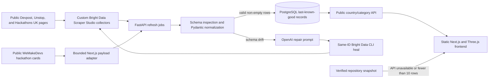

# HackRadar

HackRadar is a prize-ranked discovery desk for frequent hackathon builders. It turns fragmented public event listings into a deduplicated worldwide leaderboard and eligibility-aware views for the United States, India, the United Kingdom, and Singapore.

- **Live application:** <https://abhijitmohanty.com/scrapper/>
- **Public API:** <https://abhijitmohanty.com/scrapper-api/healthz>
- **Repository:** <https://github.com/mohantyabhijit/hackathon-scrapper>
- **Self-healing evidence deck:** <https://docs.google.com/presentation/d/1oHZxqam62OdWZeXtLP-oMonpgfl0R9OZBLsOiA9wIDA/edit?usp=sharing>

## Product experience

- Worldwide and country-specific prize-ranked top tens.
- AI, Web3, Web, Mobile, Climate, and Other filters.
- Local-currency estimates alongside canonical USD values for India, the UK, and Singapore.
- Original prize claims, dates, eligibility, participation mode, source URL, verification date, and estimated build effort on every record.
- Keyboard-accessible detail modals with complete event metadata and a direct link to the organizer's original page.
- A client-side Three.js radar with accessible semantic content and reduced-motion support.
- A checked-in verified snapshot when the live API cannot provide at least ten valid rows for the selected market.

HackRadar is a discovery product, not an organizer or application portal. Source pages remain authoritative for eligibility, dates, rules, and prizes. Currency conversions are dated display estimates and never alter ranking or stored provenance.

## Production architecture



### Frontend

Next.js produces a static export with `basePath: /scrapper`. Nginx serves versioned releases through the atomic `/srv/hackradar/frontend/current` symlink. The browser initially receives the verified repository snapshot, requests `/scrapper-api/hackathons`, and adopts live data only when the response contains at least ten rows. Request generations and abort signals prevent stale market responses from replacing the active view.

Worldwide results are deduplicated by normalized event identity. Country views apply eligibility filtering, then rank by canonical `prizeUsd`. Local currency is calculated only in the presentation layer; unknown and non-cash prizes remain undisclosed.

### Backend and database

FastAPI runs under systemd as the unprivileged `deploy` user and binds to `127.0.0.1:8095`. Nginx exposes it at `/scrapper-api/`. SQLAlchemy owns three PostgreSQL tables:

- `hackathons`: normalized event payload, canonical USD value, source URL, and update timestamp.
- `scraper_sources`: source URL, stable Collector ID, expected schema, health state, and last-good metadata.
- `studio_jobs`: asynchronous create, refresh, heal, and approve job state.

Valid collector output is normalized and upserted. Empty, failed, or drifted runs preserve the last-known-good rows. Browser reads are public; operator mutations require `X-HackRadar-Operator-Token`.

### Scraper Studio and self-healing

The backend triggers Bright Data's DCA endpoint, polls the returned collection ID, inspects the flattened schema, and normalizes contract-valid events. Authenticated operators can create a source from a plain-English goal. The OpenAI Responses API turns that goal—or a detected schema failure—into a bounded Scraper Studio instruction.

Healing keeps the same Collector ID:

1. Detect missing fields or rows that fail normalization.
2. Preserve the current PostgreSQL dataset and mark the job as drifted.
3. Generate a narrow repair instruction without inventing values.
4. Run `npx bdata scraper heal` against the same collector and exact target.
5. Approve and publish only after a non-empty, schema-valid rerun.

#### Verified Devpost recovery

The Devpost collector completed its first run but returned nine unusable rows, each containing an empty `hackathons` array. We then ran two targeted, operator-initiated heals against the same collector (`c_mt5n8l0w1kcr7uzxre`): the first flattened the event model and the second recovered detail-page fields such as prizes and dates. The final preserved run produced nine flat rows, including eight with prize text and three with complete start/end dates; the authenticated production refresh accepted three contract-valid records. This proves same-ID recovery with a human-triggered repair prompt—not yet a fully unattended healing loop.

- **Bright Data Studio — healed collector:** <https://brightdata.com/cp/scrapers/c_mt5n8l0w1kcr7uzxre>
- **GitHub Actions — successful production refresh:** <https://github.com/mohantyabhijit/hackathon-scrapper/actions/runs/32636380433>
- **Public API — source health and collector ID:** <https://abhijitmohanty.com/scrapper-api/sources>
- **HackRadar — live product:** <https://abhijitmohanty.com/scrapper/>
- **Published before/after run results:** [`scrapper-run-results/`](scrapper-run-results/)

Current collector health and evidence caveats are tracked in [the knowledge base](docs/knowledge-base.md) and [evidence matrix](docs/evidence-matrix.md).

### Luma public-event fallback

Exa MCP supplies a reviewed discovery set for public Luma hackathons in San Francisco, New York, London, Bengaluru, Mumbai, and Singapore. Two generated Studio templates failed exact-target validation, so Luma uses a deterministic Python adapter instead of being presented as a healthy Studio collector. The adapter matches the requested canonical URL to the page's JSON-LD `Event`, rejects recommendations and expired or incomplete events, and excludes attendee identities, profiles, street addresses, hidden venues, and registration-form data.

### WeMakeDevs public hackathons

WeMakeDevs is an independent `wemakedevs-global` source backed by a bounded Python adapter. It reads only the public hackathon cards embedded in the site's Next.js response, preserves the original internal or Luma event link, normalizes dates and explicitly disclosed USD prizes, and drops expired or incomplete cards. Online and hybrid entries are available in all four supported country views. The sanitized listing result is published under [`scrapper-run-results/wemakedevs/`](scrapper-run-results/wemakedevs/).

### Deployment and automation

- Nginx serves `/scrapper/` and reverse-proxies `/scrapper-api/`.
- Frontend and backend releases use versioned directories plus atomic `current` symlinks.
- `hackradar-api.service` runs Uvicorn with a root-readable environment file outside the repository.
- GitHub Actions runs the frontend/backend quality suite on pushes and pull requests.
- A scheduled GitHub Actions workflow calls the authenticated refresh endpoint; manual source-scoped dispatch is also supported. The exact cadence is defined in [`.github/workflows/collect.yml`](.github/workflows/collect.yml).
- Provider failures do not delete the last-known-good catalog.

## API surface

| Method | Route | Purpose | Access |
| --- | --- | --- | --- |
| `GET` | `/healthz` | Service liveness | Public |
| `GET` | `/hackathons?country={WORLD,US,IN,UK,SG}&category=…&limit=…` | Ranked event feed | Public |
| `GET` | `/sources` | Collector bindings and disclosed health | Public |
| `POST` | `/operators/sources` | Create a custom source and collector | Operator token |
| `POST` | `/operators/sources/{slug}/heal` | Start same-ID healing | Operator token |
| `POST` | `/operators/sources/{slug}/approve` | Approve a repaired collector | Operator token |
| `POST` | `/operators/refresh` | Refresh one or all runnable sources | Operator token |
| `GET` | `/operators/jobs/{job_id}` | Poll asynchronous job state | Operator token |

Production routes are prefixed with `/scrapper-api`; local FastAPI routes use the paths shown above.

## Tech stack

| Layer | Technology | Role |
| --- | --- | --- |
| Web application | Next.js 16, React 19, TypeScript 5.9 | Static export, market state, ranking UI, accessibility |
| Visualization | Three.js 0.181 | Client-side radar scene |
| Styling and formatting | CSS, `Intl.DateTimeFormat`, `Intl.NumberFormat` | Responsive layout, dated local-currency estimates |
| API | Python 3.12, FastAPI, Uvicorn | Public reads and authenticated background operations |
| Contracts and configuration | Pydantic, pydantic-settings | Validation, normalization, environment configuration |
| Persistence | PostgreSQL, SQLAlchemy 2, psycopg 3 | Last-known-good events, sources, and jobs |
| Web collection | Bright Data Scraper Studio, DCA API, `@brightdata/cli`, Luma JSON-LD adapter, WeMakeDevs Next.js adapter | Custom collectors, trigger/poll, create/heal/approve, bounded public-source fallbacks |
| Source discovery | Exa MCP | Reviewed public Luma event URL discovery for six target cities |
| AI repair planning | OpenAI Responses API | Bounded collector creation and schema-drift prompts |
| HTTP | HTTPX | Async Bright Data API calls |
| Frontend QA | Node test runner, Vitest, Testing Library, Happy DOM, ESLint | Ranking, currency, race, component, build, and accessibility checks |
| Backend QA | pytest, Ruff | API, contract, normalization, auth, and failure-path checks |
| Operations | Nginx, systemd, GitHub Actions | Static hosting, reverse proxy, service lifecycle, CI and scheduled refresh |

## Repository map

```text
app/                         Next.js entry, metadata, and global styles
components/                  HackRadar explorer and Three.js radar
data/hackathons.{ts,json}    Verified frontend/backend fallback snapshot
backend/src/hackradar/       FastAPI app, contracts, database, clients, services
backend/tests/               Python API and service tests
deploy/                      Nginx and systemd production definitions
.github/workflows/           Quality and scheduled refresh automation
docs/                        Architecture, operations, security, demo, evidence
tests/hackathon-*            Current frontend ranking and component tests
```

The repository also retains earlier Raster implementation and evidence modules under paths such as `config/`, `db/`, `drizzle-postgres/`, `lib/`, `scrapers/`, and older top-level tests. They remain in Git history by design but are not imported by the deployed HackRadar frontend or Python backend. Drizzle, Workers, Wrangler, and the Raster sourcing desk are therefore not part of the current production architecture.

## Local development

Requirements: Node.js 22.13+, Python 3.12+, and [`uv`](https://docs.astral.sh/uv/).

```bash
npm ci
npm run dev
```

The Next.js app uses `/scrapper` locally and in production.

```bash
cd backend
uv sync --group dev --locked
uv run uvicorn --app-dir src hackradar.app:app --reload --port 8000
```

The backend defaults to local SQLite only when `DATABASE_URL` is absent. Production uses hosted PostgreSQL.

## Configuration

Copy variable names from `backend/.env.example`; provide values through macOS Keychain or the deployment secret store.

- `DATABASE_URL`
- `BRIGHTDATA_API_KEY`
- `OPENAI_API_KEY`
- `OPERATOR_TOKEN`
- `AUTO_HEAL_ENABLED`
- `COLLECTOR_CLI_TIMEOUT_SECONDS`
- `ALLOWED_ORIGINS`

Never commit API keys, database credentials, raw authorization headers, or unsanitized provider responses.

## Quality gates

```bash
npm run lint
npm test
npm audit --omit=dev

cd backend
uv sync --group dev --locked
uv run ruff check .
uv run pytest -q
```

The latest verified release evidence lives in [the QA report](docs/qa-report.md). Operational deployment and rollback instructions live in [operations](docs/operations.md).

## Data boundary

HackRadar collects signed-out public event pages only. It does not scrape logins, accounts, applications, private communities, carts, checkout, paywalled content, personal data, restricted pages, or government systems. Every published record preserves its original HTTPS source and verification date.

## Submission evidence

Judge-facing architecture, demo steps, collector evidence, rules compliance, and honest completion gates live under [`docs/`](docs/). A provider job reaching `done` is not presented as success unless the exact target produces non-empty, schema-valid output and the public application renders the normalized model.
