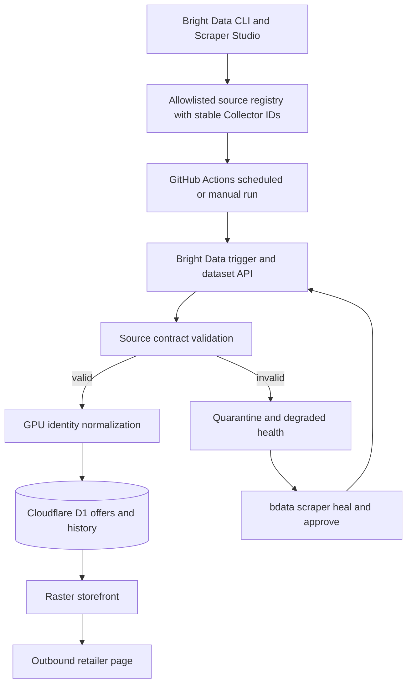

# Raster GPU Marketplace - Plan

## Goal Capsule

- **Objective:** Ship a credible GPU shopping and market-intelligence product that converts public listings from multiple regional retailers into fresh, normalized, comparable offers and gives judges direct evidence that Bright Data Scraper Studio powers the product end to end.
- **Means:** Build market-isolated comparison experiences for the United States, United Kingdom, India, and Singapore; normalize eligible long-tail retailer results into Cloudflare D1; and prove one collector can self-heal without changing its Collector ID (KTD1-KTD7).
- **Authority:** Organizer rules and best practices govern eligibility and judging proof; the Product Contract governs behavior; the Planning Contract governs implementation choices; retailer pages remain the authority at purchase time.
- **Execution profile:** Deep, code-bearing hackathon plan with sequential evidence gates and small, continuously pushed GitHub milestones.
- **Stop conditions:** Stop a source before scraping if it is login-walled, paywalled, disallows the intended public access pattern, contains personal data, or is already covered by a Bright Data pre-built scraper. Stop release if a secret appears in git history, logs, screenshots, demo footage, client bundles, or public artifacts.
- **Tail ownership:** The implementation session owns local development, Bright Data collector creation and runs, repository commits and pushes, deployment, browser verification, evidence capture, and submission-readiness checks. Legal attestations and final hackathon submission remain user-confirmed actions.

---

## Product Contract

### Summary

Raster is “the GPU market without the tab circus”: an ecommerce-style comparison site for discovering GPU offers across niche and regional retailers. It is not a merchant and does not pretend to process purchases. It aggregates public listings, explains price and stock context, and sends the shopper to the original retailer to verify and buy.

The hackathon entry deliberately combines the organizers’ strongest project patterns: prompt-to-production collection, a scheduled pipeline, self-healing, and scrapers running in CI. The storefront is the useful downstream product; terminal output, immutable `c_*` Collector IDs, sanitized snapshots, and green automation runs are the judging proof.

### Problem Frame

GPU shoppers face volatile prices, fragmented regional availability, inconsistent model names, and misleading “in stock” signals. Existing comparison tools concentrate on large US or European retailers, while the organizer explicitly wants Scraper Studio projects aimed at the long tail rather than sites already covered by Bright Data’s pre-built library. Raster wins by making regional offers comparable while showing production-grade scraper ownership, recovery, scheduling, and observability.

### Actors

- A1. **GPU shopper:** Searches, filters, compares, shortlists, and follows an offer to its source.
- A2. **Project operator:** Creates collectors, triggers runs, reviews schema health, heals failures, and verifies scheduled ingestion from the terminal.
- A3. **Hackathon judge:** Confirms the project uses real Scraper Studio collectors, preserves Collector IDs through healing, respects public-data constraints, and feeds a working downstream product.

### Key Flows

- F1. **Discover and compare offers**
  - **Trigger:** A shopper opens Raster or searches for a GPU model.
  - **Actors:** A1
  - **Steps:** Browse normalized cards, filter by GPU family/region/availability, sort within one currency, open a model detail page, and compare retailer offers with timestamps.
  - **Outcome:** The shopper reaches a retailer page with enough context to decide whether the current offer is credible.
  - **Covered by:** R6-R12
- F2. **Create and prove a collector**
  - **Trigger:** The operator onboards an eligible retailer.
  - **Actors:** A2, A3
  - **Steps:** Record the pre-built-library exclusion check, create the collector from the CLI, save only its non-secret `c_*` ID, run real URLs, validate the returned contract, and preserve sanitized evidence.
  - **Outcome:** The repository contains reproducible proof of a real create-and-run flow without exposing credentials.
  - **Covered by:** R1-R5, R17-R18
- F3. **Scheduled production refresh**
  - **Trigger:** A cron schedule or manually dispatched GitHub Action starts.
  - **Actors:** A2
  - **Steps:** Trigger allowlisted collectors, poll results, validate and normalize rows, upsert the latest offer and append price history, then publish a run summary.
  - **Outcome:** The storefront receives fresh data without dashboard-driven intervention.
  - **Covered by:** R13-R16, R20-R22
- F4. **Heal without downstream changes**
  - **Trigger:** Contract validation detects missing or invalid fields for a collector.
  - **Actors:** A2, A3
  - **Steps:** Capture the failing output, run `bdata scraper heal` with a precise description, inspect and approve the preview, rerun the same input, and prove the same Collector ID now satisfies the contract.
  - **Outcome:** The scraper is repaired in place and ingestion/storefront code remains unchanged.
  - **Covered by:** R19-R22

### Requirements

**Bright Data core and source eligibility**

- R1. Raster must use Bright Data Scraper Studio for the live retailer extraction path, with at least one real CLI create flow and real run whose stable `c_*` Collector ID is recorded as non-secret configuration.
- R2. The launch registry must cover the United States (USD), United Kingdom (GBP), India (INR), and Singapore (SGD), with at least one public niche or regional GPU source candidate per market; every enabled source must pass a documented check that Bright Data’s pre-built scraper library does not already cover it.
- R2a. An authenticated Country Pack flow must add a new country and starter retailer at runtime without a code deploy. The pack stays non-selectable and non-runnable until dated eligibility, custom Collector creation, and successful run evidence are present; shopper input must never control URLs, currencies, or Collector IDs.
- R3. Source onboarding is market-by-market. Before collector creation, live sampling must prove that a candidate exposes public GPU listings with its declared market currency; replace any candidate that fails eligibility, robots, stability, overlap, or pre-built-library checks. The judge-ready live proof may concentrate on one same-currency pair, but the product contract, registry, ingestion, and storefront must support all four launch markets.
- R4. Collection must use public pages only: no account, login, paywall, CAPTCHA bypass workflow, personal data, private API, or user-specific price.
- R5. Each extracted source row must include source slug, original title, canonical product URL, manufacturer/board partner when public, raw model text, SKU or manufacturer part number when public, price, currency, availability, image URL when public, and scrape timestamp; missing optional fields must be explicit rather than fabricated. Canonical GPU model and product identity are outputs of the shared normalization stage.

**Storefront behavior**

- R6. The public homepage must present an ecommerce-style GPU catalog with an explicit US/UK/India/Singapore market selector, search, GPU-family and retailer filters, availability filter, freshness indicator, and deterministic market-local sorting.
- R7. Cross-currency offers must never be ranked as if nominal amounts were comparable; MVP comparison and “best price” labels operate within a currency/region unless a dated conversion method is later introduced.
- R8. Each GPU model page must group matching board-partner offers, show current retailer price/stock/freshness, display source attribution, and link to the original public product page.
- R9. Price context must distinguish MSRP, current observed price, and markup/discount percentage only when an authoritative MSRP for that exact reference model or explicitly compatible model is available.
- R10. P1 stretch: a shopper can maintain a local shortlist/compare set without authentication; the feature must not claim to reserve stock, place an order, or create a retailer price alert.
- R11. All product prices and stock labels must display the last successful observation time and a visible “verify on retailer” warning.
- R12. The site must be responsive, keyboard accessible, fast enough for a live demo, and useful with fixture data when Bright Data is temporarily unavailable, while clearly labeling fixtures as demo data.
- R12a. Catalog controls use URL-owned state: submitted search, multi-select GPU-family and retailer filters, single-select availability and sort, visible active-filter chips, result count, clear-all recovery, and a deterministic default order of fresh in-stock offers followed by observed price within the selected currency.
- R12b. Freshness and health are separate states. Up to 24 hours is fresh, 24-48 hours is aging, and more than 48 hours is stale; degraded means the latest run failed validation, fixture means no live row backs the card, and unavailable means the last valid observation reported no stock. Labels, timestamps, accessible text, and sorting reflect these states without relying on color alone.

**Pipeline and persistence**

- R13. Collector IDs must be maintained in a source registry separate from credentials; the production trigger path must use the Bright Data API/CLI rather than replaying hard-coded JSON.
- R14. Raw result rows must be validated before they enter the catalog. Invalid rows are quarantined with a non-secret reason and must not overwrite the last known good offer.
- R15. Normalization must map retailer-specific naming to a stable product identity while retaining the original title and source-specific SKU for auditability.
- R16. D1 must keep the current offer state and timestamped price observations without storing login, identity, or personal data; a customer-facing recent-movement view is P1 stretch.

**Evidence, healing, and automation**

- R17. The repository must include sanitized, reproducible evidence for collector creation, a successful live run, the normalized row, and the rendered storefront result; secrets and full authorization headers are prohibited.
- R18. A judge-facing evidence matrix must map organizer expectations to artifact paths, deployed behavior, Collector IDs, and demo timestamps.
- R19. At least one source must demonstrate `bdata scraper heal`, preview/approval, and a successful rerun using the same Collector ID, with before/after contract evidence and no downstream code change.
- R20. GitHub Actions must support both scheduled and manual collection, validate output, ingest only valid rows, and surface per-source health in its job summary.
- R21. Automated healing may be demonstrated in a controlled workflow, but production auto-approval must be bounded by schema tests and source allowlists; a failed post-heal validation preserves the last known good catalog.
- R22. A run must be idempotent: retries cannot duplicate current offers or corrupt history, and a partial source failure cannot erase healthy source data.

**Security and delivery**

- R23. The Bright Data API key must live only in local secure storage, deployment secrets, and GitHub Actions secrets; it must never be committed, printed, placed in browser code, written to evidence, or shown in the demo.
- R24. Any refresh endpoint must be server-only and authenticated, accept only registered source slugs and allowlisted URLs, enforce bounded batch sizes, and avoid returning provider error bodies that may contain sensitive context.
- R25. The project must be continuously published to `mohantyabhijit/gpu-scrapper` in small green milestones, with the public branch containing code, tests, plan, safe fixtures, evidence indexes, and setup documentation.
- R26. The deployed site must be publicly accessible for judging and the README must state the product boundary, supported regions, data freshness behavior, demo flow, and retailer-attribution disclaimer.

### Acceptance Examples

- AE1. **Current offer comparison:** Given valid GBP listings for an RTX 5080 from two UK sources, when a shopper sorts by lowest price, then the lower GBP offer appears first with source, stock, and last-observed time. Covers R6-R8, R11.
- AE2. **Currency safety:** Given one USD and one INR listing, when the shopper switches markets, then Raster renders and ranks only the selected market and never calls the numerically smaller nominal amount the global cheapest offer. Covers R6-R7.
- AE3. **Failed scrape protection:** Given the latest source output has `price: null`, when ingestion runs, then the row is quarantined, the last known good offer remains visible, and CI reports the source as degraded. Covers R14, R20, R22.
- AE4. **Stable identity:** Given two retailers use different titles for the same RTX 5080 board-partner SKU, when normalized, then they appear under one model page while preserving each original title and URL. Covers R8, R15.
- AE5. **Self-healing proof:** Given a collector returns a missing required field, when the operator heals and approves it, then a rerun with the same `c_*` ID passes validation and no source-registry or consumer change is required. Covers R19, R21.
- AE6. **Secret safety:** Given a public repository clone and browser network inspection, then no Bright Data secret, authorization header, or unrestricted trigger surface is present. Covers R23-R24.

### Success Criteria

- The registry, validation, persistence, and storefront support US/USD, UK/GBP, India/INR, and Singapore/SGD with no cross-market ranking. At least two same-market retailers have healthy live collectors, 12 valid live offers total, five canonical GPU models, and three reviewed cross-retailer matches; each remaining market has at least one documented eligible candidate and demo-safe coverage until its live collector clears the release gates.
- The live site provides a coherent search-to-retailer flow using normalized D1 data and visibly dated observations.
- One complete self-heal story proves before/after behavior under the same Collector ID.
- A scheduled or manually dispatched GitHub Actions run completes with validation and a human-readable health summary.
- The evidence matrix lets a judge verify every organizer guideline in under three minutes without accessing private dashboards or secrets.

### Scope Boundaries

**In scope**

- New, publicly listed consumer GPUs across the US, UK, India, and Singapore from eligible regional/niche retailers.
- Discovery/PDP extraction, normalization, current offers, recent price history, local shortlist, outbound retailer links, scheduling, health evidence, and a demo-grade deployed storefront.
- Bright Data CLI and API as the operational surface; dashboard use is limited to confirming collector existence or schedule state.

**Deferred to follow-up work**

- Email/Discord restock alerts, user accounts, global currency conversion, shipping/tax landed-cost estimates, used-market risk scoring, affiliate tracking, and additional component categories.
- A third live retailer, price-history visualization, persistent shortlist/compare, and autonomous healing are P1 stretch work after the P0 judge-ready slice. P0 retains current offers, same-currency comparison, one manual same-ID heal, scheduled/manual CI, deployment, and evidence.

**Outside this product’s identity**

- Checkout, payment collection, inventory reservation, price guarantees, marketplace seller ingestion, login-walled data, personal recommendations based on tracking, and unlabelled AI-generated buying claims.

### Product Key Decisions

- **Regional long-tail positioning:** Target niche retailers rather than Amazon, Newegg, Best Buy, or other likely pre-built sources. Governs R2-R4.
- **Comparison storefront, not merchant:** Raster facilitates discovery and outbound purchase verification but does not transact. Governs R6-R12.
- **Proof is part of the product:** Collector IDs, terminal flows, self-heal evidence, and scheduled health are first-class judge surfaces, not README afterthoughts. Governs R17-R22.

### Dependencies

- Bright Data account access, CLI authentication, Scraper Studio availability, and an API key stored outside the repository.
- Public retailer pages that remain eligible and stable enough for the demo window.
- GitHub repository and Actions secrets for scheduled collection.
- Cloudflare/OpenAI Sites runtime with D1 binding and a public deployment path.

### Sources

- Organizer screenshots supplied on 2026-08-21: project patterns, expected deliverables, and best practices.
- `https://docs.brightdata.com/datasets/scraper-studio/build-with-the-cli` — create, run, heal, approve, batch fallback, and Collector ID behavior.
- `https://docs.brightdata.com/datasets/scraper-studio/faqs` — discovery/PDP distinctions, schema compatibility, trigger modes, and self-healing behavior.
- Candidate retailer pages for the US, UK, India, and Singapore are recorded in `docs/source-eligibility.md`; their public accessibility, declared currency, terms, and Bright Data pre-built coverage must be re-verified immediately before collector creation.
- `https://gpudrip.com/`, `https://gpusniper.com/`, and `https://www.pricesquirrel.com/gpus` — competitor patterns for MSRP context, freshness, alerts, and regional normalization.

---

## Planning Contract

### Product Contract Preservation

Product Contract bootstrapped from the user’s GPU ecommerce request and organizer-provided guidelines; no upstream requirements artifact existed.

### Key Technical Decisions

- KTD1. **A source-specific collector set behind one normalized contract.** Each retailer owns one or more role-keyed Scraper Studio collectors rather than sharing a multi-domain scraper. Site-specific code and stable Collector IDs isolate breakage, make self-healing evidence legible, and prevent one redesign from blocking all sources. Governs R1-R5, R13-R15, R19.
- KTD2. **Two-stage discovery and PDP where justified.** A source pipeline may use a discovery collector to enumerate GPU URLs and a PDP collector for complete details; a small source may use one combined collector when listing rows contain every required field. The source registry records role-keyed Collector IDs and designates the collector used for healing proof. Governs R2, R5, R13.
- KTD3. **D1 current-state plus append-only observations.** Use normalized relational tables for products, sources, offers, observations, collector runs, and quarantined rows. Current offers are upserted by source plus source SKU/URL; observations use a deterministic run key to make retries idempotent. Governs R14-R16, R22.
- KTD4. **One server-owned ingestion boundary.** GitHub Actions cron/manual dispatch sends a timestamped HMAC-authenticated request to the deployed refresh route; that route alone triggers Bright Data, validates/normalizes results, and writes D1 through the platform binding. The browser receives catalog reads only, and refresh inputs resolve from an allowlisted source registry rather than arbitrary URLs. Governs R13, R20, R23-R24.
- KTD5. **Fail stale, not empty.** Validation failure marks the source degraded and preserves its last known good offer. Freshness and health are displayed separately so stale data is never presented as current and a partial outage does not destroy the demo. Governs R11-R12, R14, R20-R22.
- KTD6. **CLI-first proof with a thin judge surface.** Operational truth comes from versioned terminal commands, GitHub Action summaries, sanitized evidence, and stable IDs. The storefront exposes only customer-facing catalog and a compact “How it works / Data health” section. Governs R17-R21, R26.
- KTD7. **Within-currency price ranking.** Store original amount and currency without silent conversion. Cross-region pages may juxtapose offers, but badges and ranking are computed only inside the same currency group. Governs R7, R9.
- KTD8. **Local shortlist instead of accounts.** Store compare selections in browser storage, avoiding identity and write-path scope while preserving ecommerce utility. Governs R10, R23.
- KTD9. **Milestone publishing.** Each usable vertical slice is tested, committed, and pushed to the named GitHub repository; secrets and raw provider logs stay untracked. Governs R17, R23, R25.

### High-Level Design

### Data Contract

- `sources`: source slug, display name, region, currency, base URL, enabled flag, and freshness target; a related collector registry stores one or more non-secret Collector IDs keyed by discovery, PDP, or combined role and marks the healing target.
- `products`: canonical model slug, vendor, GPU family/model, board partner, VRAM, reference MSRP/currency when authoritative, and normalized search text.
- `offers`: product/source identity, original title, source SKU, canonical URL, image URL, amount in minor units, currency, availability enum, last observed time, and current health.
- `price_observations`: offer ID, amount, availability, observation time, run ID, and raw-row checksum.
- `collector_runs`: source, snapshot/job ID where safe, timestamps, counts, status, validation summary, and same-ID-heal linkage.
- `quarantined_rows`: run/source identifiers, row checksum, redacted validation codes, and timestamp; no raw authorization data or personal/seller contact data.

### Security and Compliance Constraints

- Treat the previously shared Bright Data token as exposed conversational input and never place it in files or commands. Revoke and rotate it before the first live collector or CI run. Store the dedicated replacement only in Keychain or equivalent local secure storage, GitHub Actions secrets, and deployment secrets, and verify rotation without printing it.
- Pin third-party GitHub Actions by full commit SHA, use `npm ci` and the lockfile, set minimal workflow permissions, restrict secret-bearing jobs to protected scheduled/manual runs on the trusted branch, and ensure pull requests and forks never receive production secrets.
- Add `.env*`, provider output logs, raw snapshots, and local Wrangler state to ignore rules before the first public push. Commit `.env.example` with names only.
- Restrict collection manifests to approved public GPU category/product URLs. Strip seller phone/email/contact details if a regional marketplace exposes them beside product data.
- Validate every outbound URL against the source host before rendering. Use safe link attributes and never proxy arbitrary retailer resources through a privileged server route.
- Rate-limit and authenticate manual refresh. A public visitor must not be able to trigger billable collection.

### Sequencing and GitHub Milestones

1. **M0 — Plan and safety baseline:** Plan, same-market source overlap/eligibility checklist, threat model, ignore rules, secret rotation/placeholders, and repository README skeleton.
2. **M1 — One proven vertical slice:** First eligible collector set, real run evidence, raw contract, validator/normalizer, fixture, provisioned/migrated D1 binding, minimal product listing, tests, and first deployed preview.
3. **M2 — Hero self-heal protected early:** Intentionally omit one required public field in the live collector version for a fixed URL, capture failing output, heal/approve/rerun using the same URL and Collector ID, and prove no validator or downstream code changed.
4. **M3 — Comparison market:** Second same-currency retailer, at least three overlapping canonical models, region-aware filtering, offer detail, freshness/health, and catalog breadth threshold.
5. **M4 — Production automation:** HMAC-protected ingestion route, scheduled/manual GitHub Action, idempotent persistence, partial-failure behavior, and green summaries.
6. **M5 — Judge-ready release:** Browser/device QA, accessibility/performance pass, deployed public URL, evidence matrix, README, architecture diagram, demo script, and submission copy. A third live source, price-history visualization, shortlist, and auto-heal remain post-P0 stretch work.

Each milestone ends with its focused tests plus every Verification Contract gate applicable to the units completed in that milestone, then a conventional commit and push. Do not batch all hackathon work into one opaque final commit.

### Risks and Mitigations

| Risk | Consequence | Mitigation |
|---|---|---|
| Candidate already has a pre-built scraper | Weakens organizer fit | Complete the pre-built-library exclusion gate before collector creation; replace the source, not the rationale. |
| Retailer blocks, redesigns, or changes terms | Missing demo data | Maintain three isolated collectors, fixtures, last-known-good D1 state, visible freshness, and one prepared backup source. |
| Similar product names merge incorrectly | Misleading comparison | Prefer manufacturer part number, then board partner + GPU + VRAM; preserve originals and flag ambiguous matches for quarantine. |
| Cross-currency comparison misleads shoppers | Incorrect “best” claim | Rank only within currencies and label region explicitly; defer FX conversion. |
| Auto-heal accepts a plausible but wrong field | Silent catalog corruption | Require contract tests, price bounds, URL host checks, preview evidence, and post-heal rerun validation before persistence. |
| Secret leaks through git, CI, logs, or video | Disqualification and credential compromise | Rotate exposed tokens, use secret stores, redact evidence, scan git and built assets, and rehearse demo capture with masked output. |
| Scraper generation consumes the schedule | Storefront incomplete | Build M1 end to end before expanding sources; time-box source onboarding and switch to the prepared backup. |

### Assumptions

- The final submission can use a comparison storefront with outbound buying links as an ecommerce product; payment processing is not required by the organizer.
- GitHub Actions and the deployment environment can hold secrets unavailable to public code and build output.
- The organizer accepts sanitized evidence files and demo footage as proof alongside live Collector IDs.
- Exact retailer eligibility is an execution-time verification because Bright Data’s pre-built catalog and retailer terms can change; the candidate order is fixed, but any failing candidate is replaced before collection begins.

### Priority Contract

P0 is the judge-ready slice: a four-market storefront and contracts, two healthy same-currency live retailers with overlapping products, real create/run evidence, one manual same-ID heal, scheduled/manual Actions, D1 persistence, deployment, and sanitized evidence. Additional live collectors beyond the proof pair, R10’s shortlist, the customer-facing history view, and automatic heal approval are P1 stretch and cannot delay P0 release.

---

## Implementation Units

### U1. Repository, source eligibility, and secret-safety baseline

- **Goal:** Make the GPU project independently buildable and safe to publish before any provider credential or live output is used.
- **Requirements:** R2-R4, R23, R25-R26.
- **Files:** `gpuverse/README.md`, `gpuverse/.gitignore`, `gpuverse/.env.example`, `gpuverse/docs/plans/2026-08-21-raster-gpu-marketplace-master-plan.md`, `gpuverse/docs/source-eligibility.md`, `gpuverse/docs/security.md`, `gpuverse/package.json`.
- **Approach:** Copy this authoritative plan into the independent GPU project before repository initialization, rename starter metadata, document the merchant boundary, record candidate/backup source checks, define safe environment names, add secret/evidence scanning, and connect the local project to the named GitHub repository without importing unrelated parent history.
- **Test scenarios:**
  1. A clean clone installs and reaches the build/test commands without a private file.
  2. A repository scan finds no API key, bearer token, raw authorization header, or real `.env` value.
  3. Each enabled source has a dated public-data and pre-built-library eligibility record before collector creation.
- **Verification:** `npm run lint`, `npm test`, and secret scan pass from `gpuverse/`.
- **Dependencies:** None.

### U2. Collector registry, live creation, and source contracts

- **Goal:** Produce real, isolated Scraper Studio collectors and safe proof of their create/run behavior.
- **Requirements:** R1-R5, R13, R17.
- **Files:** `gpuverse/config/sources.ts`, `gpuverse/scrapers/manifests/*.json`, `gpuverse/scrapers/contracts/gpu-offer.schema.json`, `gpuverse/scripts/collect.ts`, `gpuverse/scripts/validate-collector-output.ts`, `gpuverse/evidence/collectors/README.md`, `gpuverse/tests/collector-contract.test.ts`.
- **Approach:** Onboard the first source fully before cloning the pattern. Store stable Collector IDs or secret-name references in the registry, never the API key. Use discovery/PDP only where necessary and preserve sanitized create/run transcripts plus small redacted fixtures.
- **Test scenarios:**
  1. A valid live or fixture result passes the shared contract and preserves source-specific fields.
  2. Missing price, off-domain URL, unsupported currency, malformed Collector ID, and non-public contact fields fail with explicit codes.
  3. Batch fallback and empty-result responses end in bounded error states rather than infinite polling.
- **Verification:** Focused contract tests pass; two same-market source records have real role-keyed Collector IDs and valid live output, while a third eligible source is recorded for expansion or backup.
- **Dependencies:** U1.

### U3. D1 schema and idempotent ingestion

- **Goal:** Convert validated source rows into auditable current offers and price history without erasing good data on failure.
- **Requirements:** R14-R16, R22.
- **Files:** `gpuverse/.openai/hosting.json`, `gpuverse/vite.config.ts`, `gpuverse/db/schema.ts`, `gpuverse/db/index.ts`, `gpuverse/drizzle/*.sql`, `gpuverse/lib/normalize/gpu.ts`, `gpuverse/lib/ingest.ts`, `gpuverse/tests/normalization.test.ts`, `gpuverse/tests/ingestion.test.ts`.
- **Approach:** Provision the production D1 resource, configure the Sites `DB` binding and local/test behavior, apply migrations before first ingestion, then implement canonical identity matching with MPN-first rules, minor-unit prices, explicit currencies, deterministic run/checksum keys, transactional upserts, append-only observations, and quarantine. Keep source titles and URLs for auditability.
- **Test scenarios:**
  1. Two naming variants with the same public MPN map to one product and two offers.
  2. Ambiguous titles without a defensible identity are quarantined instead of merged.
  3. Replaying the same run creates no duplicate observation; a changed price creates exactly one new observation.
  4. A failed source run retains the last good offer and marks its freshness/health degraded.
  5. Local/test and deployed environments can perform a D1 read/write smoke test after migrations.
- **Verification:** Database migration generation is clean, migrations apply to clean local and provisioned remote D1 databases, and normalization/ingestion tests plus binding smoke tests pass.
- **Dependencies:** U2.

### U4. Public catalog and model comparison experience

- **Goal:** Turn the collection pipeline into a polished, credible ecommerce-style shopping flow.
- **Requirements:** R2a, R6-R12b, R16, R26.
- **Files:** `gpuverse/app/page.tsx`, `gpuverse/app/gpu/[slug]/page.tsx`, `gpuverse/app/how-it-works/page.tsx`, `gpuverse/app/globals.css`, `gpuverse/components/*`, `gpuverse/lib/catalog.ts`, `gpuverse/tests/rendered-html.test.mjs`, `gpuverse/tests/catalog.test.ts`.
- **Approach:** Build a visually focused homepage whose hierarchy is search, active filters/result count, GPU cards, and trust/data-health explanation. The server merges four baseline markets with ready D1 Country Packs; pending packs remain visible only in the health ledger. Model pages prioritize current same-currency offers, retailer exit actions, freshness/source cues, authoritative MSRP context, and then recent price movement when the P1 history slice is enabled. Use semantic landmarks/headings, labelled form controls, keyboard-operable controls, announced result changes, visible focus, non-color status text, adequate touch targets, and cards/tables that reflow at narrow widths. Keep operational controls out of the customer UI; local shortlist is P1 stretch.
- **Test scenarios:**
  1. Search and filters produce deterministic URLs and empty states.
  2. Mixed currencies never receive a single cheapest badge or misleading global sort.
  3. Stale/degraded offers remain distinguishable from fresh offers and retain source links.
  4. Keyboard navigation, labelled controls, announced result changes, focus states, reduced motion, touch targets, narrow screens, missing images, and no-JavaScript server output remain usable.
  5. Markup/discount appears only when an authoritative compatible MSRP exists; otherwise the claim is omitted.
  6. Price movement renders only from same-currency observations with an accessible text summary and handles insufficient/stale history without inventing a trend.
- **Verification:** Component/catalog tests, full build, HTML assertions, browser smoke test, responsive screenshots, accessibility scan, and outbound-link inspection pass.
- **Dependencies:** U3.

### U5. Protected production trigger and scheduled CI

- **Goal:** Refresh all enabled collectors on a schedule and prove reliable downstream ingestion without human dashboard work.
- **Requirements:** R13-R16, R20, R22-R24.
- **Files:** `gpuverse/lib/bright-data/client.ts`, `gpuverse/app/api/refresh/route.ts`, `gpuverse/lib/pipeline.ts`, `gpuverse/.github/workflows/collect.yml`, `gpuverse/tests/bright-data-client.test.ts`, `gpuverse/tests/refresh-route.test.ts`, `gpuverse/tests/pipeline.test.ts`.
- **Approach:** Build a bounded trigger/poll client and one server-owned pipeline behind a timestamped HMAC request using a dedicated rotation-friendly secret, five-minute replay window, constant-time signature check, source allowlist, bounded batch, and per-caller rate limit. GitHub Actions only schedules/signs the request and renders the returned summary; the route owns Bright Data and D1. Schedule conservatively and retain manual dispatch for judging.
- **Test scenarios:**
  1. Anonymous, invalid-secret, arbitrary-URL, disabled-source, and oversized requests are rejected before provider calls.
  2. Provider timeout, rate limit, malformed JSON, partial source failure, and delayed dataset completion yield bounded, redacted results.
  3. One healthy source still ingests when another fails, and rerunning the job remains idempotent.
  4. The Action summary reports source, counts, freshness, and status without secrets or raw provider bodies.
- **Verification:** Client/route/pipeline tests pass with provider mocks; a manual Action run completes against live collectors and D1; scheduled syntax is validated.
- **Dependencies:** U2-U3.

### U6. Same-ID self-healing and CI guardrails

- **Goal:** Deliver the organizer’s hero proof that owned scraper code can be repaired while the downstream system remains stable.
- **Requirements:** R18-R21.
- **Files:** `gpuverse/scripts/check-source-health.ts`, `gpuverse/scripts/heal-source.ts`, `gpuverse/evidence/healing/README.md`, `gpuverse/tests/healing-policy.test.ts`; stretch only: `gpuverse/.github/workflows/heal-demo.yml`.
- **Approach:** In the live collector version, intentionally omit one required public field for a fixed allowlisted retailer URL, capture pre-heal output, heal with a narrow description, inspect/approve, rerun the same URL, and compare IDs plus contract health while proving no validator/consumer change. Manual terminal healing is P0; CI auto-approval is stretch and may persist nothing unless post-heal validation passes.
- **Test scenarios:**
  1. A missing required field generates a concise heal prompt and enters the healing path.
  2. An unrelated provider failure, access denial, implausible price, changed domain, or still-invalid preview never auto-approves.
  3. Successful healing retains the exact Collector ID and requires no change in registry, trigger, ingestion, or storefront files.
  4. Failed healing leaves current catalog data intact and publishes a degraded summary.
- **Verification:** Policy tests pass; sanitized before/preview/after evidence proves same-ID recovery; downstream tests pass with no consumer modification.
- **Dependencies:** U2, U5.

### U7. Judge evidence, release QA, and submission package

- **Goal:** Make the implementation easy to verify, demo, deploy, and submit under time pressure.
- **Requirements:** R17-R18, R25-R26 and all Success Criteria.
- **Files:** `gpuverse/README.md`, `gpuverse/docs/evidence-matrix.md`, `gpuverse/docs/demo-script.md`, `gpuverse/docs/architecture.md`, `gpuverse/docs/submission.md`, `gpuverse/evidence/README.md`.
- **Approach:** Index only sanitized evidence, map every organizer guideline to a live behavior/artifact, document Collector IDs without tokens, rehearse a short terminal-first demo, validate the public deployment, and prepare submission copy and screenshots.
- **Test scenarios:**
  1. A reviewer can follow the README from clone to fixture demo and understand how to run live collection with their own secret.
  2. Every evidence-matrix row points to an existing safe artifact or public URL.
  3. Demo capture reveals no secret, personal data, dashboard account detail, or unsupported price claim.
  4. The deployed site works in a clean signed-out browser on desktop and mobile widths and gracefully handles a stale source.
- **Verification:** Full release gate passes, public URL is smoke-tested, secret scan covers git history and built assets, and the demo rehearsal fits the submission time limit.
- **Dependencies:** U4-U6.

---

## Verification Contract

| Gate | Command or evidence | Applies to | Pass signal |
|---|---|---|---|
| Static quality | `npm run lint` | U1-U7 | Zero lint errors. |
| Production build | `npm run build` | U1-U7 | Vinext/Worker build succeeds with no missing binding or server/client secret leak. |
| Full automated suite | `npm test` | U1-U7 | Build and all repository tests pass. Extend the script to include new TypeScript/unit suites. |
| D1 schema | `npm run db:generate` plus migration diff review | U3 | Deterministic migration exists and applies to a clean local D1 database. |
| Collector contract | Focused collector/normalizer tests and one live CLI run | U2-U3 | Valid row reaches normalized fixture; invalid rows are rejected safely. |
| Pipeline integration | Manual `collect.yml` dispatch against live secrets | U5 | All enabled sources report bounded outcomes; valid rows reach D1; no secret appears in logs. |
| Same-ID healing | Sanitized before/preview/after evidence | U6 | Required field recovers, exact Collector ID matches before/after, and downstream files need no change. |
| Browser behavior | Clean-profile desktop/mobile smoke test | U4, U7 | Search, filter, model detail, source link, freshness, stale state, and currency grouping work; shortlist/history are included only when their P1 slices ship. |
| Accessibility | Automated scan plus keyboard pass | U4 | No critical accessibility violations; visible focus and logical navigation are confirmed. |
| Security | Secret scan of working tree, git history, CI logs, and built assets | U1, U5-U7 | No credential or authorization material found; refresh abuse cases are rejected. |
| Deployment | Public URL and API-read smoke checks | U7 | Signed-out judge can load representative pages; data timestamps and disclaimers render correctly. |

Release validation is blocked if the live site contains only fixtures, if no real Collector ID can be shown, if the heal changes the ID, if scheduled collection has never completed, or if evidence contains a secret.

---

## Definition of Done

### Global Completion

- Every P0 requirement is implemented; explicitly labelled P1 stretch behavior may remain deferred and cannot be represented as shipped.
- At least one real Scraper Studio create/run flow, two healthy same-market live sources with meaningful overlap, a third eligible expansion/backup record, and one same-ID healing flow are verifiable.
- The production pipeline is scheduled, manually dispatchable, idempotent, partial-failure safe, and visibly feeds the deployed storefront.
- The public site is responsive, accessible, signed-out usable, current enough for the demo, honest about stale/fixture data, and never implies Raster is the merchant.
- The GitHub repository contains the implementation, plan, safe fixtures, tests, evidence index, and documentation in a readable milestone history; all required commits are pushed.
- The Bright Data key and every other secret remain outside source, history, logs, screenshots, build output, and demo footage; an exposed credential is rotated before release.
- Dead-end experiments, obsolete starter content, temporary debug routes, generated raw provider output, and abandoned code are removed from the final diff.
- The evidence matrix, architecture explanation, demo script, submission text, and public URL are complete enough that final submission requires no product or technical invention.

### Unit Completion

- U1 is done when a clean clone is safe and buildable, eligibility decisions are documented, and the GitHub target is established.
- U2 is done when the collector registry and contracts are tested, two same-market source records have real role-keyed Collector IDs and valid live evidence, and a third eligible expansion/backup source is recorded.
- U3 is done when normalization and D1 ingestion are transactional, idempotent, auditable, and preserve last-known-good data.
- U4 is done when the customer journey works across representative desktop/mobile/keyboard conditions with correct currency and freshness semantics.
- U5 is done when live scheduled/manual automation safely refreshes D1 and reports per-source health without secret exposure.
- U6 is done when same-ID healing is proven and its automation guardrails reject unsafe outcomes.
- U7 is done when the release gates, public deployment, judge evidence, and submission package are verified.
